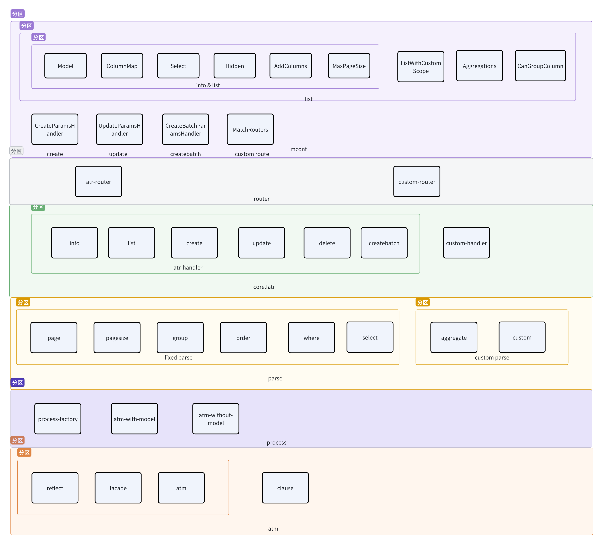

### 结构


#### mconf

```go
type ColumnAddFunc func(ctx context.Context, line map[string]interface{}, addKey string) interface{}
type SaveParamsHandler func(ctx context.Context, params interface{}) (map[string]interface{}, error)
type SaveBatchParamsHandler func(ctx context.Context, params interface{}) ([]map[string]interface{}, error)
type ListWithCustomScope func(ctx context.Context, customJson []byte) (clause.Scope, error)


type MpModel struct {
	Model         reflect.Type
	ColumnMapping map[string]string         
	Select        []string                   
	Hidden        []string                   
	AddColumns    []map[string]ColumnAddFunc 
	MaxPageSize   int                       
	ListWithCustomScope      ListWithCustomScope 
	CreateParamsHandler      SaveParamsHandler
	CreateBatchParamsHandler SaveBatchParamsHandler
	UpdateParamsHandler      SaveParamsHandler
	Aggregations             []Aggregation
	CanGroupColumn           []string
	addSelect                []string
	MatchRouters             []CustomRoute
}
```
>mconf 是对项目的配置后续操作中的路由、控制器、参数过滤、查询处理、查询后的数据过滤都会用到mconf的配置 <br>
> 是按需配置的  通过 `type SetModel func() map[string]MpModel` 如果不需要初始化的时候传nil即可

* model 配置对应表的model
* ColumnMapping 用来修改表字段展示的名字，所有接口都会用到
* Select 指定需要查询的列 list 、 info 用到
* Hidden 指定需要隐藏的列 list 、 info 用到
* AddColumns 指定需要额外增加的列，可以用来修改查询到列的值  list、info 用到
* MaxPageSize 设置改变分页最大pageSize    list 用到
* ListWithCustomScope 用来自定义解析字段  list用到
* CreateParamsHandler create前 对数据做过滤、填充等操作 create 用到
* CreateBatchParamsHandler createBatch前 对数据做过滤、填充等操作 createBatch 用到
* UpdateParamsHandler update前 对数据做过滤、填充等操作 update 用到
* Aggregations 增加聚合查询列 比如 count(*) sun(score) 等结果，但是以来开启分组，且查询条件带分组 list接口用到
* CanGroupColumn 可以用来支持分组的字段 填入后则可以在请求中使用
* MatchRouters 支持的自定义路由 

#### router

>  默认路由支持 info、list、create、createBatch、delete、update <br>
>  通过 `type SetCustomModel func() map[string][]MpModel` 进行初始化配置自定义路由 自定义路由是指定表的某些接口支持 

#### Handler

> handler是接收请求的入口 定义了一个core.Iatr接口 Atr实现了这个接口 <br>
> handler 支持自定义 在setUp时传入 实现 core.Iatr 接口的 结构即可

#### parse 

> 解析参数成和配置成atm需要的结构

#### process
> 通过process-factory 构造出atm操作实例,调用atm完成数据库操作并根据mconf完成后续的数据结构变更操作。

#### atm

> atm是个单独的package，封装了gorm操作提供了三个入口.
> reflect通过对model的反射进行gorm操作，atrg用到了个因为使用哪个model是通过请求来控制的，没法手动的写模型。<br>
> facade 不传入model时通过表名做db操作,封装了atm泛型传入部分
> atm 通过泛型来接收不通过结构的model 完成db操作